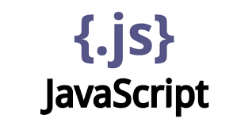
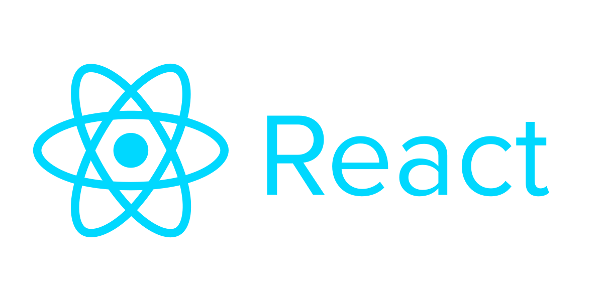
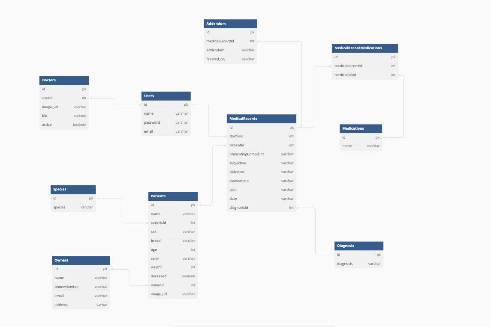

# Retriever

### *Retriever is software that allows targeted retrieval of veterinary medical records!*

## Application Overview
Most veterinary software systems are built in a way that makes retrieving targeted medical records tedious and time consuming. Retriever was designed to be an intuitive and targeted retrieval of medical records based on the needs of a practicing veterinarian. 

This project is my fullstack capstone, the culmination of a 6 month intensive full stack coding bootcamp. My goals were to explore the power of server side by incorporating complex logic on server side thereby lightening client side's responsibility, gain more experience with css by creating a website in dark mode without the use of bootstrapped components and create a seamless and intuitive user experience. 

## Features
* Doctors can create/edit/delete their own medical records and addendums
* Hospital managers can view/activate/deactivate doctor profiles
* All users can view all patient medical records, addendums, patient and owner information
* All users can edit/create new patients and owners
* All users can filter all patients by species, diagnosis, medication, patient and owner names.
* All users can filter all patient medical records by medication and diagnosis

## Technology Used





## Running This Application

### Start Client Side
1.  Clone this repository and change to this directory in the terminal.
```
git clone git@github.com:neszeto/Retriever-Client.git
cd Retriever-Client
```

2. Start development server
```
npm install --save react-router-dom
npm start
```

### Start Server Side
1. Clone the server repository and change to that directory in the terminal.
```
git clone git@github.com:neszeto/Retriever-server.git
cd Retriever-server
```
2. Start virtual environment
```
pipenv shell
```
3. Start the debugger to run server
```
python manage.py shell
```

## Demo User Login
To view the application as a **doctor**, please sign in using the following credentials:
* username: *sjones*
* password: *123*

To view the application as a **hospital manager**, please sign in using the following credentials:
* username: *nlorrel*
* password: *123*

OR register and sign in as a new user 

## Demo
*In the making...please check back again!*

## ERD


### Created By Nora Szeto 
### View my <a href="https://www.linkedin.com/in/nora-szeto/" target="_blank">Linkedin</a>

